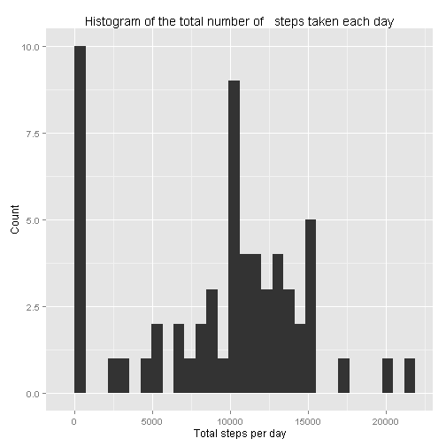
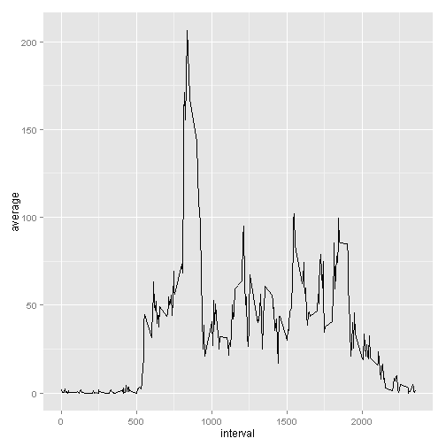
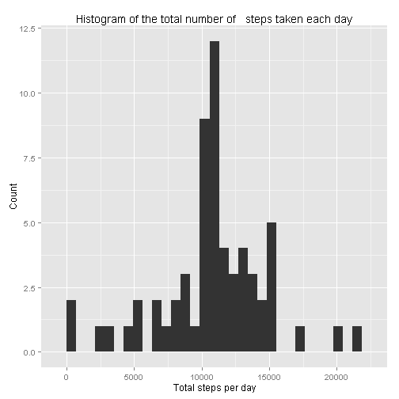
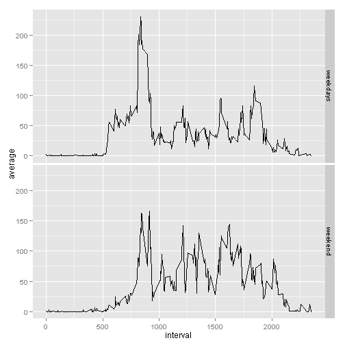

# Reproducible Research: Peer Assessment 1


## Loading and preprocessing the data


```r

activity <- read.csv("./data/activity.csv", header = TRUE, colClasses = c("numeric", 
    "Date", "numeric"), na.strings = "NA")

library(lubridate)
activity$date <- ymd(activity$date)  ##transform column date as a date
```


## What is mean total number of steps taken per day?


```r

# Sum of total steps per day

totalsteps <- data.frame(totalsteps = sapply(split(activity$step, activity$date), 
    sum, na.rm = TRUE))

## Histogram of the total number of steps taken each day

library(ggplot2)

qplot(totalsteps, data = totalsteps, xlab = "Total steps per day", ylab = "Count", 
    main = "Histogram of the total number of   steps taken each day")
```

```
## stat_bin: binwidth defaulted to range/30. Use 'binwidth = x' to adjust this.
```

 

```r

meansteps <- mean(totalsteps$totalsteps)
mediansteps <- median(totalsteps$totalsteps)
```


The mean total number of steps taken by day is **9354.2295**  
The median  total number of steps taken by day is **1.0395 &times; 10<sup>4</sup>**

## What is the average daily activity pattern?


```r

## average steps across intervals

averagesteps <- data.frame(average = sapply(split(activity$step, activity$interval), 
    mean, na.rm = TRUE))
averagesteps$interval <- as.numeric(row.names(averagesteps))

## plot

ggplot(averagesteps, aes(interval, average)) + geom_line()
```

 

```r

## Which 5-minute interval, on average across all the days in the dataset,
## contains the maximum number of steps?

maxsteps <- subset(averagesteps$interval, averagesteps$average == max(averagesteps$average))
```


The interval with contains the maximum number of steps is the interval **835**

## Imputing missing values


```r

missing <- sum(is.na(activity$steps))
```


The number of rows with missing value is **2304**


```r

# for each missing value in steps, the mean of the mean of the corresponding
# 5-minute interval is imputed

activity2 <- activity

for (i in 1:nrow(activity2)) {
    if (is.na(activity2[i, 1]) == TRUE) 
        
    {
        x <- subset(activity2, activity2[, 3] == activity2[i, 3])
        activity2[i, 1] <- mean(x$steps, na.rm = TRUE)
    }
}

# Sum of total steps per day

totalsteps2 <- data.frame(totalsteps = sapply(split(activity2$step, activity2$date), 
    sum, na.rm = TRUE))

## Histogram of the total number of steps taken each day

library(ggplot2)

qplot(totalsteps, data = totalsteps2, xlab = "Total steps per day", ylab = "Count", 
    main = "Histogram of the total number of   steps taken each day")
```

```
## stat_bin: binwidth defaulted to range/30. Use 'binwidth = x' to adjust this.
```

 

```r

meansteps2 <- mean(totalsteps2$totalsteps)
mediansteps2 <- median(totalsteps2$totalsteps)
```


**Dataset with missing values**  
The mean total number of steps taken by day is **9354.2295**  
The median  total number of steps taken by day is **1.0395 &times; 10<sup>4</sup>**  
**Dataset without missing values**  
The mean total number of steps taken by day is **1.0766 &times; 10<sup>4</sup>**  
The median  total number of steps taken by day is **1.0766 &times; 10<sup>4</sup>**  

## Are there differences in activity patterns between weekdays and weekends?


```r

# create levels

activity2$weekdays <- as.factor(weekdays(activity2$date, abbreviate = TRUE))
levels(activity2$weekdays) <- c("weekend", "weekday", "weekday", "weekday", 
    "weekday", "weekend", "weekday")

# create subsets for weekdays and weekend

weekday.act <- data.frame(subset(activity2, activity2$weekdays == "weekday"))
weekend.act <- data.frame(subset(activity2, activity2$weekdays == "weekend"))

# compute means

weekday.ave <- data.frame(average = sapply(split(weekday.act$step, weekday.act$interval), 
    mean, na.rm = TRUE))
weekday.ave$interval <- as.numeric(row.names(weekday.ave))
weekday.ave$weekdays <- as.factor(c("weekdays"))

weekend.ave <- data.frame(average = sapply(split(weekend.act$step, weekend.act$interval), 
    mean, na.rm = TRUE))
weekend.ave$interval <- as.numeric(row.names(weekend.ave))
weekend.ave$weekdays <- as.factor(c("weekend"))

average <- rbind(weekday.ave, weekend.ave)

ggplot(average, aes(interval, average)) + facet_grid(weekdays ~ .) + geom_line()
```

 


